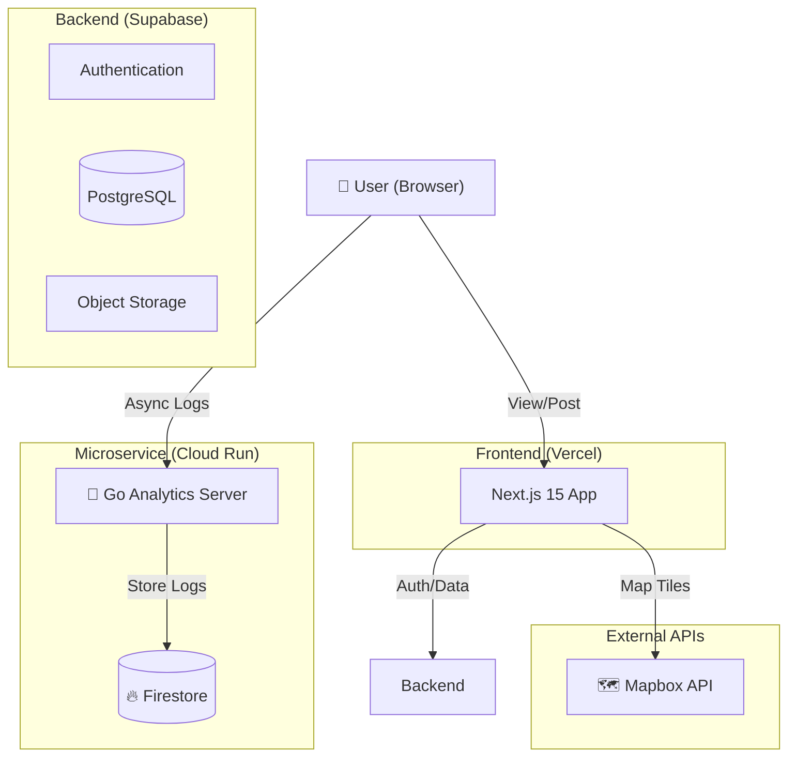

# Mirutabi (ミルタビ) - Visual Journey Archive 🌍

<p align="center">
  
</p>

<p align="center">
  <b>「この道を辿れば、同じ感動に出会える」</b><br>
  Route Sharing & Trust-based Travel SNS built with Next.js 15
</p>

<p align="center">
  
  
  
</p>

---

## 📖 概要 (Overview)

**Mirutabi** は、単なる写真共有ではなく、「移動の軌跡（ルート）」と「信頼（Trust）」を共有する次世代の旅行SNSです。
きれいな写真だけでは伝わらない「そこへ行くまでの物語」や「実際の移動手段」をマップ上に可視化。**信頼スコアアルゴリズム**により、広告やインフルエンサーマーケティングに埋もれない、本当に価値ある旅情報をユーザーに届けます。

## ✨ 主な機能 (Key Features)

### 1. 🗺️ Visual Route Sharing (ルート共有)
* **概要:** 旅の行程をマップ上に線と点で描き出し、他のユーザーが「追体験」可能な形式で保存。
* **技術:** `Mapbox GL JS` を採用し、高速かつ美しいベクトル地図描画を実現。

### 2. ⭐ Trust Score System (信頼性スコア)
* **概要:** "いいね"の数だけでなく、情報の具体性やユーザーの過去の行動履歴から「情報の信頼度」を算出。
* **技術:** 独自の重み付けアルゴリズムにより、質の高い情報をフィード上位に表示。

### 3. 📸 Experience Archive (体験アーカイブ)
* **概要:** 写真と場所、そしてその時の感情をセットで記録。
* **技術:** `Supabase Storage` による画像管理と、位置情報メタデータの自動抽出。

### 4. 📊 Golang Analytics Service (ログ分析)
* **概要:** ユーザーの行動ログを高速に処理・分析するための専用マイクロサービス。
* **技術:** `Go (Gin)` + `Firebase Firestore` on `Cloud Run`。メインのNext.jsアプリから切り離すことで、パフォーマンスへの影響を最小限に抑えています。

---

## 🛠 技術スタック (Tech Stack)

| Category | Technology | Usage |
| :--- | :--- | :--- |
| **Frontend** | **Next.js 15** (App Router) | SSR/RSCによる高速なページ描画 |
| **Language** | **TypeScript** | 型安全性と開発効率の向上 |
| **Styling** | **Tailwind CSS** | Shadcn UIを用いたモダンなUI設計 |
| **Backend** | **Supabase** | Auth, Database (PostgreSQL), Storage |
| **Microservice** | **Go (Gin)** | 高負荷なログ収集・分析サービス |
| **Database (Log)** | **Firestore** | 分析用NoSQLデータベース |
| **Maps** | **Mapbox / Google Maps** | 地図描画・場所検索API |
| **Deployment** | **Vercel / Cloud Run** | フロントエンド / マイクロサービス |

---

## 🏗️ アーキテクチャ (Architecture)



### 🐹 Go Microservice Strategy
アクセス解析や行動ログの収集は、書き込み頻度が非常に高く、メインのDB（PostgreSQL）のリソースを圧迫する可能性があります。
そこで、**Go言語** による軽量・高速な専用サーバーを構築し、ログデータを **Firestore** へ逃がすアーキテクチャを採用（**CQRS**パターンの簡易適用）。
これにより、ユーザー数が増加してもメインのSNS機能（閲覧・投稿）のパフォーマンスを維持します。

---

## 🚀 セットアップ (Getting Started)

### Prerequisites
* Node.js 18+
* Supabase Project

### Installation

1. Clone the repository:
   ```bash
   git clone https://github.com/naki0227/mirutabi.git
   cd mirutabi
   ```

2. Install dependencies:
   ```bash
   npm install
   ```

3. Set up environment variables:
   Create `.env.local`:
   ```env
   NEXT_PUBLIC_SUPABASE_URL=your_url
   NEXT_PUBLIC_SUPABASE_ANON_KEY=your_key
   NEXT_PUBLIC_MAPBOX_TOKEN=your_token
   ```

4. Run:
   ```bash
   npm run dev
   ```

---

## 👨‍💻 開発者 (Developer)
**Enludus** (Information Science Student)

Focus: Web & Mobile App Development
Contact: <https://enludus.vercel.app>

<p align="center"> 
    © 2025 Enludus. All rights reserved. 
</p>
